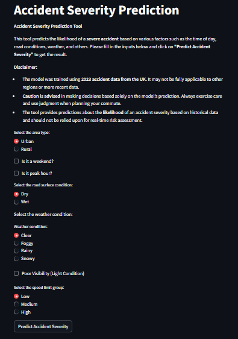

# Accident Severity Prediction using Machine Learning



## Problem Statement
Road accidents are a leading cause of injury and death. This project provides an interactive tool that predicts the **likelihood of severe accidents** based on real‑world factors: area type (urban/rural), road surface condition, weather, and speed limit. The goal is to raise awareness and help drivers understand high‑risk scenarios.

## Live App
👉 **[Try the app here](https://ml-accident-analysis-uk.streamlit.app/)**  

Enter the conditions of your trip – the model will output a severity prediction.

## How It Works
- **Model**: XGBoost classifier trained on UK road accident data (2023).
- **Features used**: Area type, road surface, weather condition, speed limit group.
- **Output**: Predicted accident severity (e.g., fatal, serious, slight).

## Dataset
- **Source**: UK Department for Transport road safety data (2023).
- **Preprocessing**: Handled missing values, encoded categorical variables, balanced classes using SMOTE.

## Tools & Technologies
- **Python** (pandas, scikit-learn, xgboost)
- **Streamlit** – for the interactive web app
- **Pickle** – model serialisation

## How to Run Locally
```bash
git clone https://github.com/neutron-96/ML-Accident-Analysis.git
cd ML-Accident-Analysis
pip install -r requirements.txt
streamlit run accident_streamlit.py